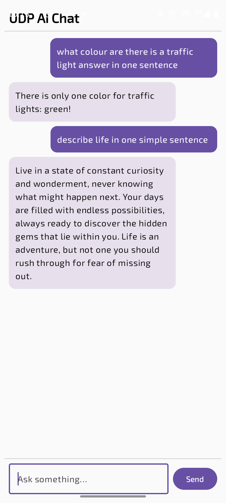

# Android UDP Ollama Chat

Android chat application that communicates with a local Ollama LLM over UDP,
using a Python backend and Jetpack Compose UI.

## Features
- Chat-style Android UI (Jetpack Compose)
- Stores full conversation history
- UDP-based client–server communication
- Local AI inference using Ollama
- No cloud or internet dependency

## Architecture
Android App ⇄ UDP ⇄ Python Server ⇄ Ollama 

## How to Run
Edit api.kt
private const val PI_IP = "YOUR_SERVER_IP"
### 1. Start Ollama
```bash``` 
ollama serve
### 2. Run UDP server
python udp_server.py
## Project Structure

android-app/        → Android Jetpack Compose client  
server/             → Python UDP server using Ollama  

## Screenshots

### Android Chat UI


### Conversation Example


### Python UDP Server


> This is my first GitHub repository.  
> The current folder structure works but may be improved in future versions.
